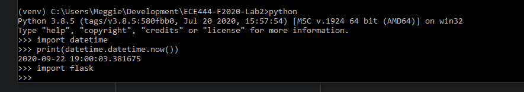
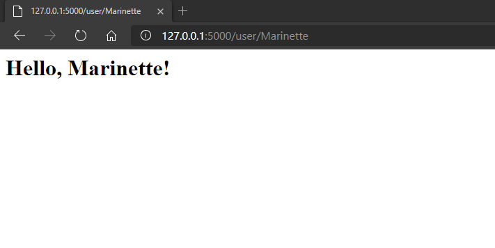

Marinette
This repo is a clone of https://github.com/miguelgrinberg/flasky

# Activity 1

#Activity 2

#Activity 3
Flask context globals are global variables that are temporary available to view functions. There are four different types:

Context global name | Description
--------------------|-------------
current_app | Returns the application instance
g | Can be used as temporary storage during request handling
request | Contains the details of the request sent by client
session | A dict that can store values that the application wants to remember throughout sessions

current_app and g depend on the application context to be pushed and request and session require the request context to be pushed.
